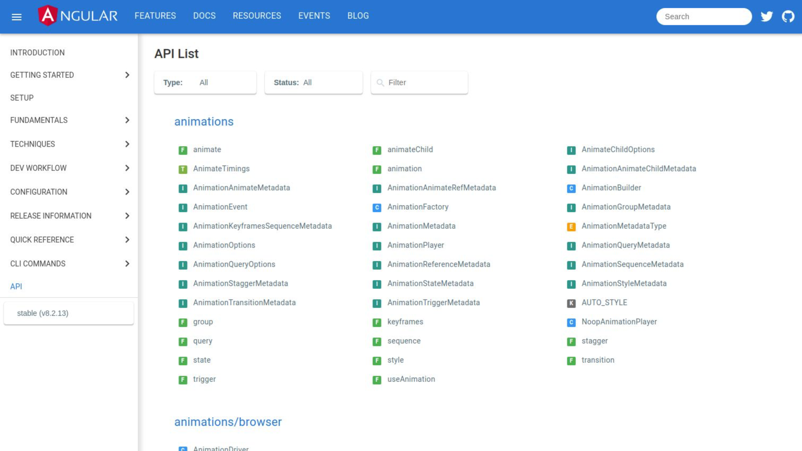

# Find it in the docs

Slides in PDF file ['here'](./slides.pdf).

Code examples generated with `angular-cli`. It should be easy to use.

Most important things you will find in:
- `main.ts` platform initializer example
- `widgets.module.ts` DoBootstrap interface example
- `news.module.ts` app initializer example
- `gdpr.module.ts` example of `APP_BOOTSTRAP_INITIALIZER`

## Development server

Run `ng serve` for a dev server. Navigate to `http://localhost:4200/`. The app will automatically reload if you change any of the source files.
